# K Means Algorithm

It is one of the famous algorithm for tackling unsupervised learning task susch as clustering. One of the basic example of the kmeans algirthm can be seen from the clustering of `Two dimensional` datapoints.

`Data Blobs`  
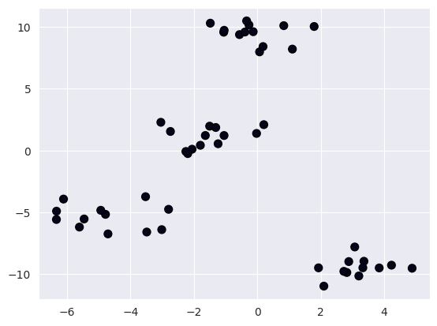

`After Clustering`  
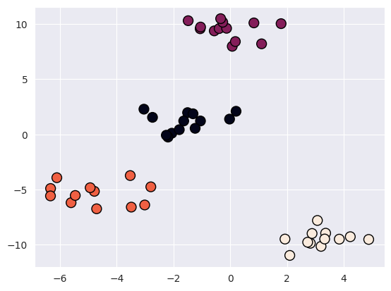

In real life, the data features are big like for a 3 channel image, the featuer could be `3` * `height` * `width` 


The algorithm for the K means algorithm is given as :


1. Specify the number of clusters $`K`$.
2. Initialize the cluster centroids with any initialization methods.

3. Compute the distance between each point and each cluster centroids(Euclidean distance metric is a popular choice) Where distance is a vector in $`\mathbb R^{N} `$ for all data points and for all $`K`$ centroids, distances will be a matrix in $`\mathbb R^{K \times N} `$.
```math
 distance = \|\mathbf{x}_i - \boldsymbol\mu_k \|_2^2
```

4. Assign each point to the closest cluster centroid (minimum distance).

5. Compute the new cluster centroid for each cluster by taking the mean of all the data points in that cluster.
6. Repeat steps 3-5 until there is no change in the cluster centroids.


 
### Coordinate Descent
  
The objective function for the kmeans algorithm is shown below :

```math
\mathcal{J}(\boldsymbol{\mu}, \boldsymbol{c}) = \sum_{k=1}^K \sum_{i=1}^N \mathbb{1} \{\boldsymbol{c}_i = k\} \|\mathbf{x}_i - \boldsymbol{\mu}_k \|^2_2
```
 

So, we can break our objective function as follows:

1. **Assigning observations to the nearest cluster prototype:**

```math
\boldsymbol{c_i}  \leftarrow \underset{k}{\arg\min} \| \mathbf x_i - \boldsymbol \mu_k\|^2_2 \tag{3}
```

Here $`\boldsymbol{c}`$ is a vector that contains the assignment indexes of the $`k^{th}`$ centroid to which the $`i^{th}`$ data point belongs.

2. **Updating the cluster centers:**

```math
\boldsymbol \mu_k = \frac{\sum^N_{i : \boldsymbol c_i=k} \mathbf{x}_i}{|\boldsymbol{c}_{i=k}|}
```

Now, after assigning data to the nearest cluster for the previous centroid $`\boldsymbol \mu_k`$, we have to update the new centroid $`\boldsymbol \mu_k`$ by taking the mean of all the $`i^{th}`$ data points in cluster prototype $`\boldsymbol c`$ where $`\boldsymbol c_{i=k}`$. Since computing the mean of a set of observations is equivalent to computing its center of mass, we can re-write our second equation as a minimization objective:

```math
\boldsymbol \mu_k \leftarrow \underset{\mu}{\arg\min} \sum_{i: \boldsymbol{c}_i = k} \| \mathbf{x}_i - \mu \|^2_2
```

This is an example of **Coordinate Descent optimization**.

## K means algorithm in 2D Datapoints

For this task I have created a class `Point` . Its attributes are x, y and label. `Label` here refer to the cluster index the point belongs to.

```python
class Point():
    def __init__(self,x,y,label) :
        self.x = x
        self.y = y
        self.label = label
```


### Random Centroid Initialization
Now, once we get data, we randomly initialize a centroid. The number of centroid is equal to the clusters we want the data to be divided into. 
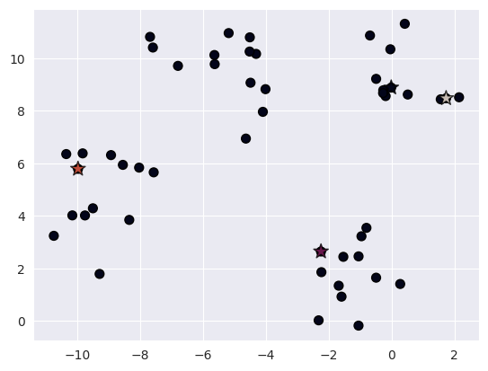


### Update Points Label
The above stars are the randomly initialized centroids.Now we calculate the distance between centroids to each points. The points will be given the label of the centroid they are closest to.

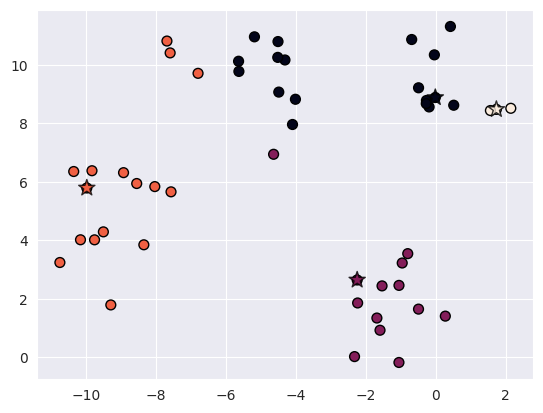

### Final Output
And once we update the label we , update the centroid value by taking the mean of the points beloning to each cluster. And repeating this step will give us :

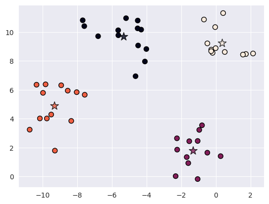


## K means algorithm in Mnist Dataset

Mnist dataset contains hand drawn images in grayscale. Here is one of the data from mnist dataset.

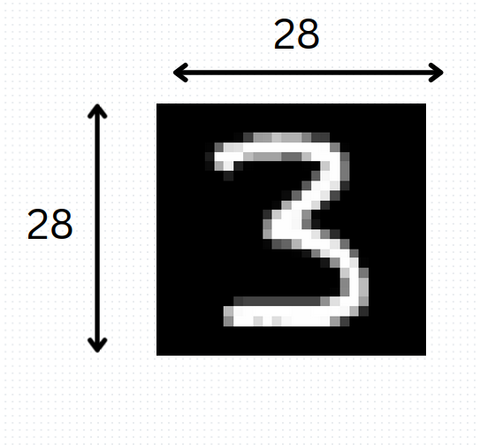

Now if we compare this to 2D datapoints, here we have `28 * 28` features.

Similar to previous problem, here we first define a random centroid. 

> to initialize centroid, i have randomly initialized mean of random data to the centroids.


```python 
random_image = []
for i in range(self.n_clusters):   
    random_indices = random.sample(range(X.shape[0]), 50)
    random_image.append(np.mean(X[random_indices],axis=0))
random_centroids = np.array(random_image)
self.plot_data(random_centroids)

return random_centroids
```

The initial centroid looks like this :

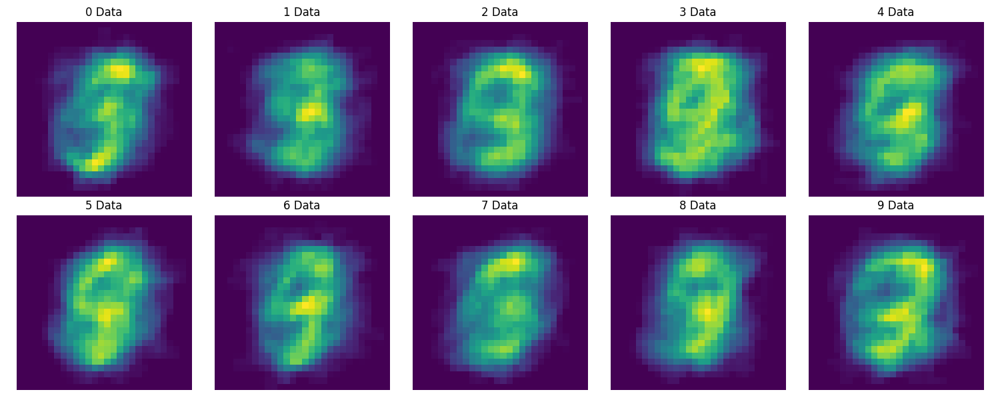


We can see the data are random , but with each iteration , the final centroids will look closer to average of each clusters.

So, after centroid initialization, we find the distance with each image.

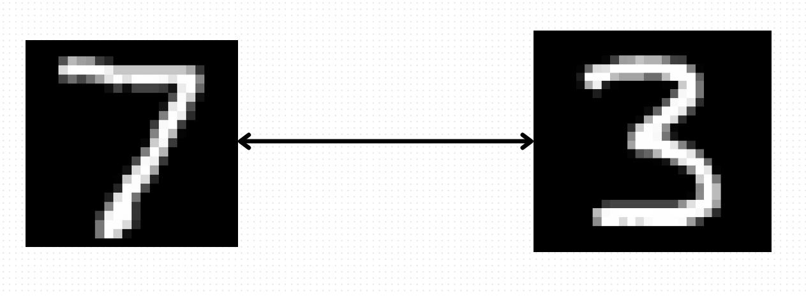

Code Implementation
```python
return np.sqrt(np.sum(np.power((x1 - x2), 2).flatten()))
```
Here we calculate element wise difference and take root of their sum.

And after we calculate distance, we assign these data to nearest centroids and update their labels

`Code implementation`

```python
distance_error = 0
for i, data in enumerate(sample_data):
    min_dist = float('inf')
    min_index = -1
    for j, centroid in enumerate(self.centroids):
        dist = self.get_distance(data, centroid)
        if dist < min_dist:
            min_dist = dist
            min_index = j
    sample_label[i] = min_index
    distance_error += min_dist
distance_error /= sample_data.shape[0]
return sample_label,distance_error
```

`And to update the centroid`

```python
temp_centroids = []
for j in range(self.n_clusters):
    target_index = []
    for i,label in enumerate(sample_label):
        if label == j :
            target_index.append(i)

    if target_index:
        centroid = np.mean(sample_data[target_index], axis=0)
    else:
        centroid = self.centroids[j]  # No change if no data points are assigned to this cluster
    temp_centroids.append(centroid)
return np.asarray(temp_centroids)
```

So with each iteration , the centroid will become closer to their data clusters

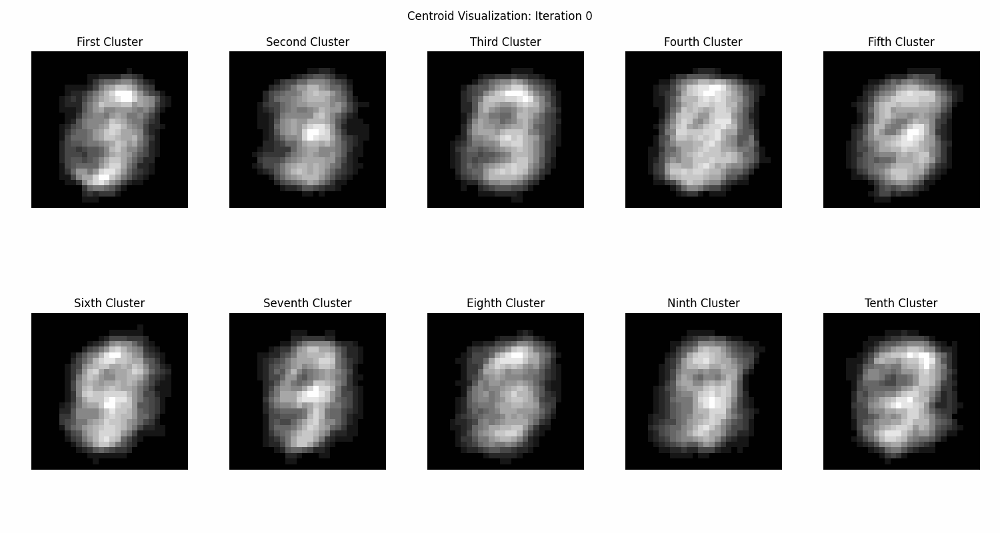


And after the complete iteration

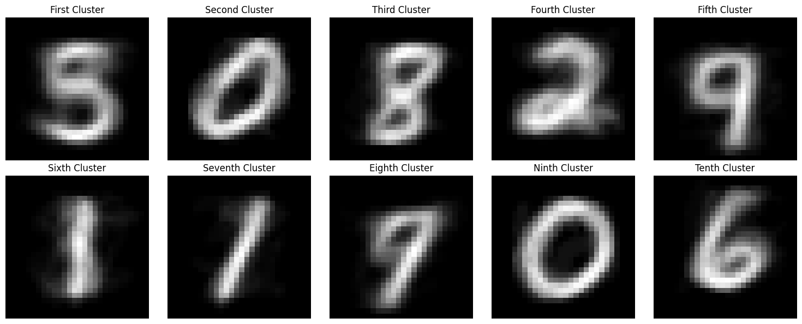

`Predictions`

Since this is a unsupervised learning we can't directly predict the label of the image, but we can find the closest centroid the given image is close to

```python
predictions = []
for data_point in data:
    min_dist = float('inf')
    min_index = -1
    for j, centroid in enumerate(self.centroids):
        dist = self.get_distance(data_point, centroid)
        if dist < min_dist:
            min_dist = dist
            min_index = j
    predictions.append(min_index)
return predictions
```

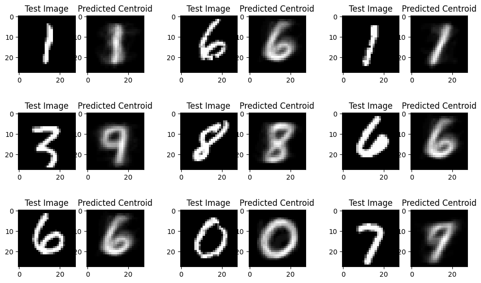


## Sample Code to run the program

```bash
python main.py --epochs 10 --iteration 200 --batchsize 500
```

### `Training History`

If we look at the history of just one epoch, i.e the iteration is done on single batch of data. Then we can see the distance of datapoints from the centroid keeps decreasing. But we can't do this on the whole dataset as the whole dataset is around 60000 images, and training them all at once would consume huge memoery. So I have made a batch generator which samples data of `batchsize`.

Code Implementation
```python
batch_size = min(batch_size, data.shape[0])
random_indices = random.sample(range(data.shape[0]), batch_size)
return data[random_indices]
```

`Training history for only one batch group`

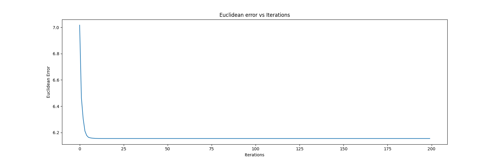

`Training history for multiple batches`

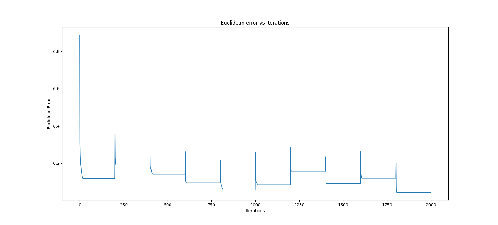

We can see the centroid becomes the optimum cluster centroid for a certain batch and when a new batch comes , its distance from the new data is more , so there is a spike, now the centroid agains learn the features of that batch and keeps on learning. And eventually learn the whole data.